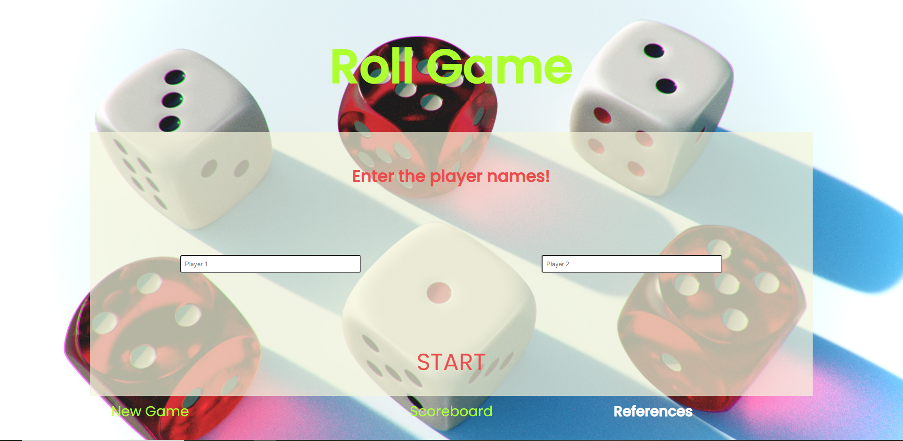
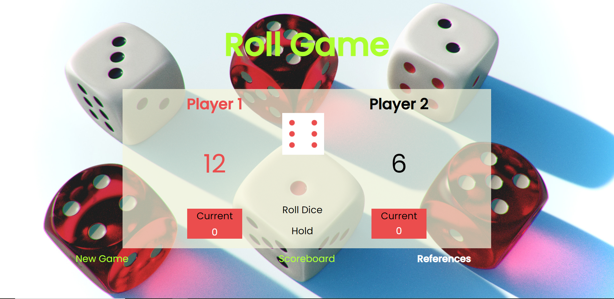
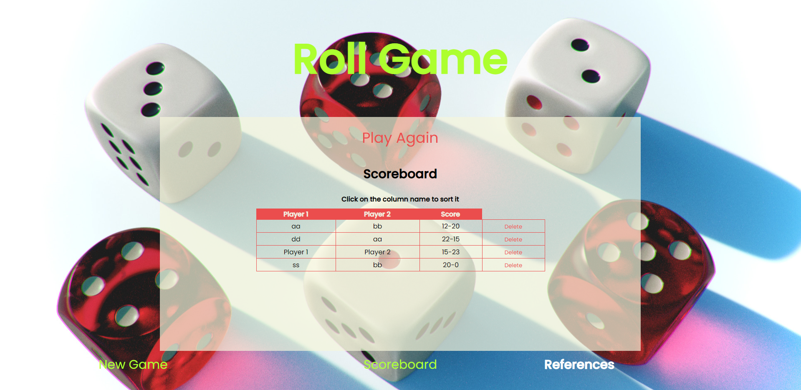
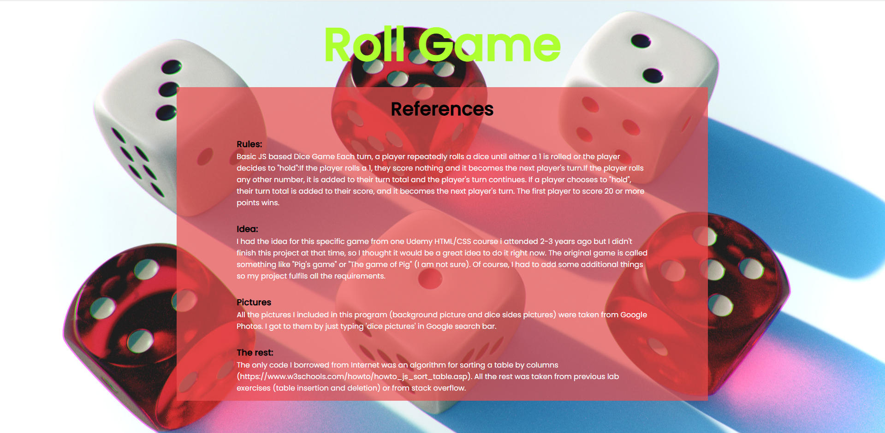
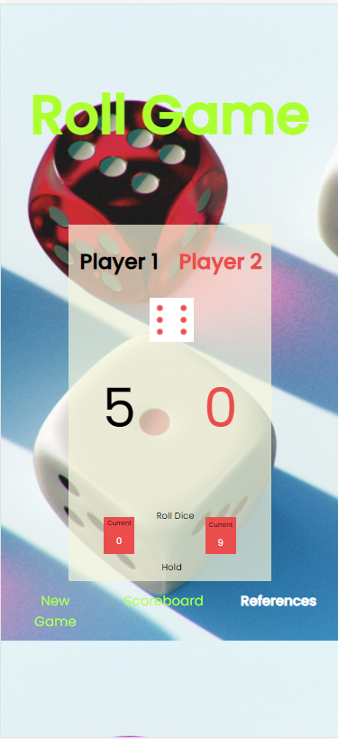

# Dice Roll
## Summary
This is the recreation of the 'Pig's Game' using HTML5, JavaScript, CSS and jQuery.

Pig is a simple dice game first described in print by John Scarne in 1945. Players take turns to roll a single die as many times as they wish,
adding all roll results to a running total, but losing their gained score for the turn if they roll a 1.

Pig often serves as a simple example for teaching probability concepts from the middle school level upwards. The game also provides exercises for teaching Computer Science in areas ranging from introductory courses to advanced machine learning material.

## Rules

Each turn, a player repeatedly rolls a die until either a 1 is rolled or the player decides to "hold":

- If the player rolls a 1, they score nothing and it becomes the next player's turn.
- If the player rolls any other number, it is added to their turn total and the player's turn continues.
- If a player chooses to "hold", their turn total is added to their score, and it becomes the next player's turn.
- The first player to score 20 or more points wins.

For example, the first player, Donald, begins a turn with a roll of 5. Donald could hold and score 5 points, but chooses to roll again. Donald rolls a 2, and could hold with a turn total of 7 points, but chooses to roll again. Donald rolls a 1, and must end his turn without scoring. The next player, Alexis, rolls the sequence 4-5-3-5-5, after which she chooses to hold, and adds her turn total of 22 points to her score.

## Scoreboard

Whenever you finish a game, the scores add to the 'Scoreboard', and the data is stored with localStorage so it is not just temporary. You can also delete scores and sort them
by columns of your choice.

## References

In the references page, i described the idea behind the project and I wrote all references for it.

## Mobile 

This project is also Mobile friendly, which you can check out in your browser or in the picture below.

